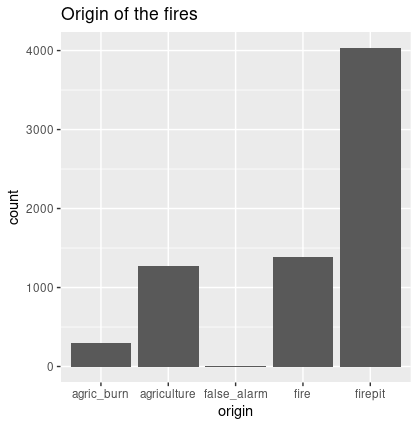
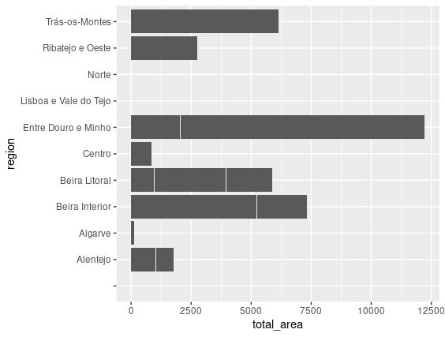

## Introduction
Nowadays, wildfires have a significant impact on our planet, destroying thousands of hectares of forest each year and even causing the death of many species, potentially leading to their extinction. These fires can have different causes: natural, accidental human actions, or intentional causes.
We consider Data Mining to be the process of exploring large amounts of data in search of consistent patterns. Through the analysis of atmospheric conditions, it is possible to create a model capable of predicting the causes of wildfires and, therefore, improve preventive measures to avoid disasters.

## Problem Definition
The goal of this project is to build a machine learning model capable of predicting the causes of wildfires in 2015.
The project was implemented using the R programming language.

### Task 1 - Data Importation, Cleanup, and Pre-Processing
In this part of the project, our focus was to make the dataset easier to analyze.
To achieve this, it was necessary to remove certain attributes and preprocess the data.

The first step was to remove unnecessary attributes:
  - **firstInterv_date and firstInterv_hour:** These attributes refer to the date and time of the first intervention by firefighters in response to the wildfire. They are not relevant since they do not influence the cause of the fire, which is what we aim to predict.
  - **alert_source:** This attribute contains only NA values, making it irrelevant to the results.
  - **extinction_date and extinction_hour:** These attributes relate to the time and date when the fire was extinguished, which is not relevant to its origin.

The remaining attributes were kept because they are necessary:
  - **id:** This unique identifier helps distinguish different records (int type).
  - **region, district, municipality, and parish:** These attributes correspond to the region, district, municipality, and parish, which are important for locating the fire and may be useful for our study (factor type).
  - **lat and lon:** These attributes are also related to location, making them essential. They were originally of type char.
  - **origin:** This is a categorical attribute indicating the origin of the wildfire (factor type).
  - **alert_date and alert_hour:** These attributes indicate the date and time of the fire alert (factor type).
  - **village_area, vegetation_area, and farming_area:** These attributes represent the area of habitable land, vegetation, and cultivated land, respectively.
  - **village_veget_area:** This attribute represents the sum of the village and vegetation areas.
  - **total_area:** This attribute is the sum of all the previously mentioned areas.
  - **cause_type:** This is the attribute that specifies the cause of the fire, which we aim to predict with our machine learning model.

Handling Missing Values
After evaluating the necessary attributes, we found missing values in the region attribute. These missing values were represented by a "-" instead of a valid name.
  - **First Approach:** We attempted to replace the missing values by cross-referencing similar records with different IDs, but this method proved to be computationally expensive.
  - **Second Approach:** We decided to remove all records with missing values in the region attribute.

Handling Latitude and Longitude Issues
Another issue encountered was inconsistency in the latitude and longitude values, where some records contained dates instead of coordinates (e.g., "1900-01-01 14:53:21" instead of actual latitude and longitude).
To resolve this, we ignored the first part ("1900-01-01") and kept only the time component ("14:53:21").
Additionally, we converted latitude and longitude from DMS (Degrees Minutes Seconds) format to decimal format.

Adding a New Feature
To improve the predictive power of the model, we added a new column with the maximum temperature (TMAX), obtained using a script provided in the project instructions (getTemperatureNOAA.R).

### Task 2 - Exploratory Data Analysis
This section involved summarizing and visualizing key data to understand where wildfires had the most severe impact.

Fire Origin (Img1)         |  Total Burned Area (Img2)
:-------------------------:|:-------------------------:
       |  

	
From Img1, we observe that most wildfires were caused by firepit, as expected, while agric_burn fires were significantly fewer. The least frequent category was false_alarm. This attribute was analyzed to gain a clearer understanding of the most common causes of wildfires.

Img2, which represents the total burned area, shows that the most affected region was Entre Douro e Minho, with nearly 12,500 hectares burned. In contrast, the least affected regions were North, Lisbon and Tagus Valley, and Algarve, where burned areas were much smaller.
This highlights a considerable disparity in the extent of burned areas across different regions.

### Task 3 - Predictive Modelling
Among the various models available for predicting wildfire causes, we selected three: k-Nearest Neighbors (k-NN), Naive Bayes, and Random Forests.

k-Nearest Neighbors (k-NN) is an intuitive and simple algorithm that relies on comparing samples. It makes no assumptions about the data and can be applied to various problems as long as sufficient data is available. Additionally, it does not require explicit training since it is an instance-based learning method, meaning it learns by analogy based on similarity between cases.

Naive Bayes is another simple and easy-to-implement algorithm. It is highly efficient, making it a strong candidate for rule-based learning. It also has high processing speed and requires fewer data points for classification, making it well-suited for real-time predictions.

Random Forests was ultimately chosen as the best model. It can be used for both classification and regression tasks and is one of the most user-friendly machine learning algorithms.

A forest consists of multiple decision trees, and the more trees it contains, the more robust the model becomes.
This model is more accurate than k-NN and Naive Bayes since it leverages a greater number of attributes. However, its main drawback is that it requires more processing time.
How Random Forests Works:
The algorithm follows four steps:

Selects random samples from the dataset.
Builds a decision tree for each sample and generates predictions.
Votes on each prediction made by the trees.
Chooses the prediction with the most votes as the final result.
Advantages of Random Forests:
Highly accurate and robust due to the large number of decision trees involved.
Handles missing values by replacing them with computed medians.
For our predictive modeling, we selected the following features: region, district, latitude, longitude, origin, alert_date, village_area, vegetation_area, farming_area, and cause_type.

After applying the Random Forests model, we obtained an accuracy score of 0.67229, which was higher than k-NN (0.55284) and Naive Bayes (0.62966).

## Conclusions
One possible improvement in the initial phase of the project would have been to estimate missing values in the region attribute instead of removing those records. This could have led to better model performance.
In summary, this project allowed us to explore different machine learning models and understand which ones perform best in various situations. Additionally, it helped us enhance our R programming skills.
